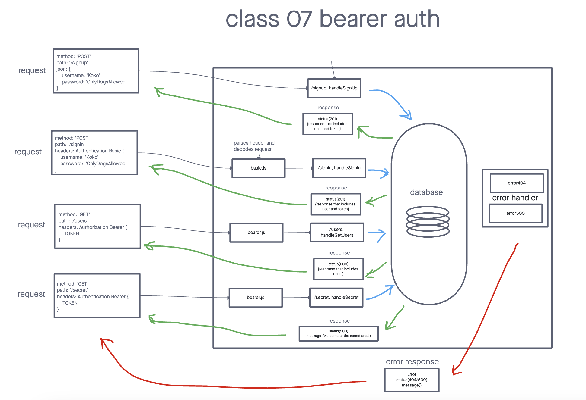

# Bearer Auth

>  **Authentication Server Phase 2: Token (Bearer) Authentication** Auth-server is able to allow a user to create an account as well as to handle Basic Authentication (user provides a username + password). When a “good” login happens, the user is considered to be “authenticated” and our auth-server generates a JWT signed “Token” which is returned to the application

## Installation

> Start with: `npm install`

> Set your PORT environment with an .env file

```text
PORT=3001
DATABASE_URL={SQL_database_link}
```

## Usage

Signup request:
```text
method: POST
route: /signup
json: {
  username: 'Koko'
  password: 'OnlyDogsAllowed'
}
```

Signin request:
```text
method: POST
route: /signin
headers: Authentication Basic {
  username: 'Koko'
  password: 'OnlyDogsAllowed'
}
```

Get Users request:
```text
method: GET
route: /users
headers: Authentication Bearer {
  TOKEN
}
```

Secret request:
```text
method: GET
route: /secret
headers: Authentication Bearer {
  TOKEN
}
```

## UML Diagram


## PR link
[PR link Class 07](https://github.com/cleecoloma/bearer-auth/pull/1)

## Contributors
> Chester Lee Coloma